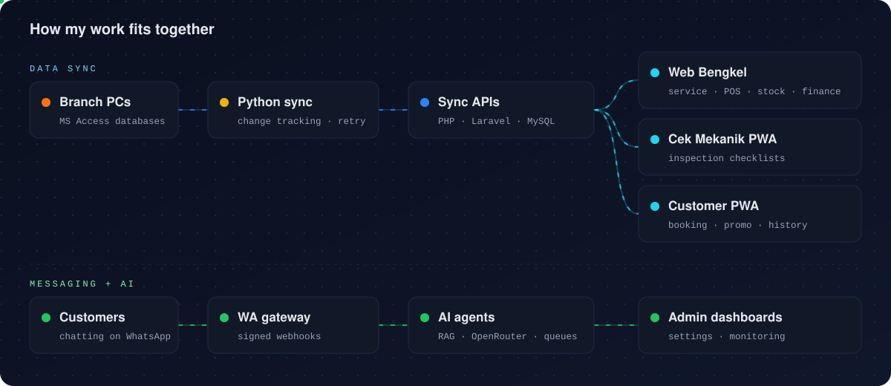

  

## 👋 About

Most of my repositories are internal tools for **FIT MOTOR**, a multi-branch motorcycle workshop, built around problems the team runs into every day:
branch cashiers closing out their day, mechanics inspecting a motorcycle before a service, customer service staff identifying a customer's bike type, customers booking a service, divisions requesting work from IT.

I usually start a project with a written PRD, a design, and a task breakdown, then build it with Laravel / PHP or Next.js / TypeScript, package it with Docker, and deploy it to a VPS.
I also maintain an older PHP workshop system and sync data between it and the legacy branch databases.
I use Claude Code as part of my development workflow.

## 🧠 What I Build

- **Business workflow apps.** Multi-step processes with roles, statuses, approvals, and audit trails.
- **Operational systems for branches.** Service orders, point of sale, purchasing, stock, cashier closing, and bank deposits, all scoped per branch.
- **Mobile-first PWAs** for mechanics and customers, with offline support for unstable connections.
- **Data sync and integration.** Python agents that read branch Microsoft Access databases and push changes to web APIs, plus Excel/PDF import and export.
- **Automation and AI.** Scheduled jobs, browser automation with Playwright, and WhatsApp agents that answer from a knowledge base.

  

## 🛠️ Tech I Work With

  

| Area | Technologies |
| --- | --- |
| **Languages** | PHP · TypeScript · JavaScript · Python · SQL · Bash |
| **Backend** | Laravel (API, Blade, Livewire, queues and scheduler) · native PHP with PDO · Next.js route handlers · Express |
| **Frontend** | Next.js (App Router) · React · Tailwind CSS · Alpine.js · Recharts |
| **Data** | MySQL · PostgreSQL · SQLite · Prisma ORM · Microsoft Access (read via pyodbc) |
| **Testing** | PHPUnit · Pest · Vitest · Playwright (E2E and browser automation) |
| **Infra** | Docker / Docker Compose · Nginx · Supervisor · VPS deployment with shell scripts and GitHub Actions |
| **Integrations** | Auth.js · Laravel Socialite · WhatsApp gateway webhooks · OpenRouter / OpenAI-compatible APIs · PhpSpreadsheet / Laravel Excel / ExcelJS · FPDF / Dompdf |
| **Team projects** | Hono · Drizzle ORM · BullMQ + Redis · Vue 3 · shadcn-vue |

## 🚀 Featured Projects

  
  
  
  
  
  

<b>PUBLIC</b> repositories are linked · <b>PRIVATE</b> ones are company-internal · <b>TEAM</b> projects were built together with a teammate or vendor

<b>More projects</b>

 

| Project | What it does | Stack |
| --- | --- | --- |
| [**Kasir**](https://github.com/rafiadli719/kasir) | Daily cashier closing per branch: opening cash, income and expenses, handover between cashiers, bank deposit recap, central finance reports, Excel/PDF export | PHP · PDO · MySQL · PhpSpreadsheet · FPDF |
| **Motor Identifier Service** `private` | One search box to identify a customer's motorcycle type from a plate, frame, or engine number, resolved in tiers (exact → prefix → contains → fuzzy) | Laravel · MySQL · Laravel Excel · Pest |
| **Project Checklist Dashboard** `private` | Progress tracking for IT projects, modules, and features, with MoSCoW priority, a REST API, and a webhook other projects report progress to | PHP (no framework) · SQLite · Alpine.js · Docker |
| **ScrapeMaps** `private` | Small tool that collects business listings from Google Maps by city and category | Node.js · Express · Playwright |

## 📚 Currently Working On

- **RAFI-Agent** `private`: a personal WhatsApp assistant (Next.js + Prisma) that answers IT troubleshooting questions from a knowledge base using embedding search, and auto-replies when I'm busy. Early stage.
- **Web Bengkel**: module-by-module end-to-end validation, bug fixes, and performance work.
- **Cek Mekanik**: inspection history, an operations dashboard for admins, and sync packages for each branch.

## 📈 GitHub Activity

  
  

  

  <picture>
    <source media="(prefers-color-scheme: dark)" srcset="https://raw.githubusercontent.com/rafiadli719/rafiadli719/output/github-snake-dark.svg" />
    
  </picture>

## 🔗 Connect

  

